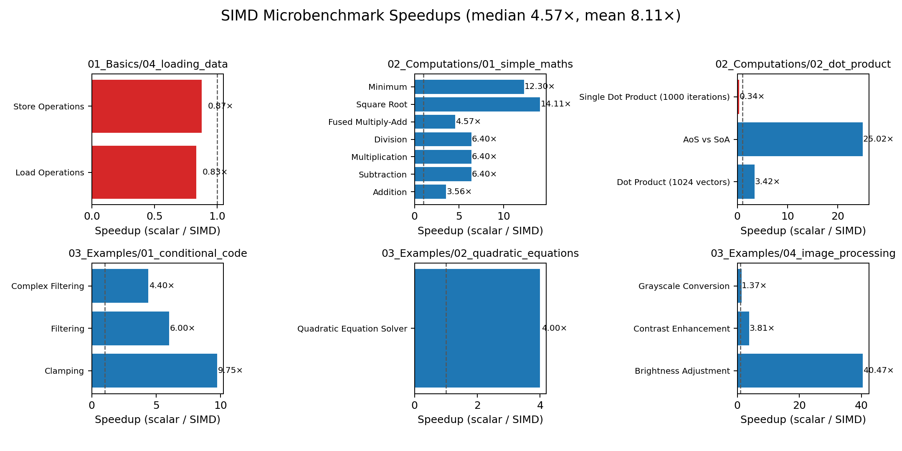
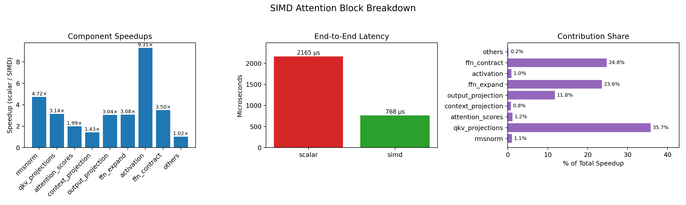
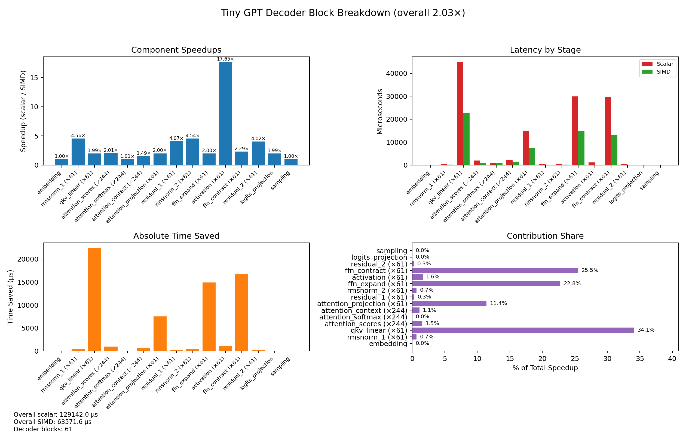

# Hands-on SIMD Programming with C++

From “what is SIMD?” to “how do I speed up transformer layers?”—this repository walks through reproducible AVX2 microbenchmarks, tuning tricks, and a quantised decoder block.






## Quick Start

```bash
./runme.sh
# optional: tweak CSVs then regenerate the figures
python scripts/plot_results.py
```

`runme.sh` rebuilds every sample, refreshes `artifacts/*.csv`, and redraws all figures (kept under [`artifacts/`](artifacts) so the root stays clean).

## Highlights by Module

| Module | Highlights | Use Cases / Benchmarks |
| --- | --- | --- |
| **01_Basics** | Loads, alignment, data initialisation, intrinsics setup | `01_importing_simd`, `04_loading_data` |
| **02_Computations** | Vector arithmetic, FMA, AoS→SoA dot products | `01_simple_maths`, `02_dot_product` |
| **03_Examples** | Conditional masks, quadratic solver, image ops, quantised attention, 61-block decoder | `01_conditional_code`, `04_image_processing`, `05_mha_block`, `06_tiny_gpt` |

Every example ships with scalar **vs.** SIMD implementations and an embedded benchmark so you can quantify the payoff.

## Reading the Figures

1. **SIMD Speedups** – six canonical kernels showing alignment, arithmetic, SoA wins, mask-driven control flow, equation solving, and image transforms (speedups from 0.8× to 40×).
2. **Attention Breakdown** – RMSNorm + MHA + FFN block with component speedups, end-to-end latency, and contribution share (≈2.8× faster overall).
3. **Tiny GPT Breakdown** – 61-block decoder with int8 weight stores and SIMD dequantisation; the 2× end-to-end gain is unpacked by stage, absolute savings, and contribution percentages.

## Key Takeaways

- Memory layout matters: we transpose matrices and lean on SoA buffers so AVX2 loads stay contiguous.
- Quantised linear layers use per-channel scales plus `_mm256_cvtepi16_epi32` / `_mm256_fmadd_ps` to recover float outputs without leaving vector code.
- Accuracy is always checked—SIMD activations are compared against scalar references, and quantised logits agree on the predicted token.
- Automation keeps results fresh: rerunning `runme.sh` recompiles, re-benchmarks, and redraws the conference-style plots.
- The tiny GPT demo stacks 61 decoder blocks, so the CSV/plot counts capture how repeated kernels dominate end-to-end latency.

## License

MIT
